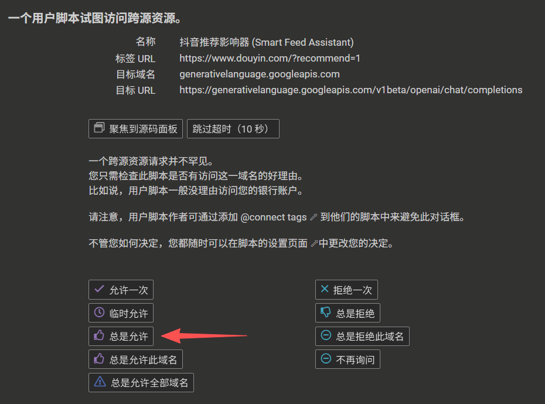

# 抖音推荐影响器 (Douyin Smart Feed Assistant)

<div align="center">


**通过 AI 智能分析，让你的抖音推荐流更符合你的品味**

[快速开始](#安装指南) • [使用教程](#使用教程零基础版) • [常见问题](#常见问题faq) • [贡献代码](#贡献指南)

**如果这个项目对你有帮助，请点击右上角 ⭐ Star 支持一下！**

</div>

---

## 📑 目录

- [项目简介](#项目简介)
  - [核心特性](#核心特性)
  - [效果展示](#效果展示)
- [安装指南](#安装指南)
  - [第一步：安装浏览器扩展管理器](#第一步安装浏览器扩展管理器)
  - [第二步：安装本脚本](#第二步安装本脚本)
- [使用教程（零基础版）](#使用教程零基础版)
  - [步骤一：获取 API Key](#步骤一获取-api-key)
  - [步骤二：配置脚本](#步骤二配置脚本)
  - [步骤三：设置偏好规则](#步骤三设置偏好规则)
  - [步骤四：启动脚本](#步骤四启动脚本)
  - [步骤五：查看统计与停止](#步骤五查看统计与停止)
- [高级选项说明](#高级选项说明)
- [常见问题（FAQ）](#常见问题faq)
- [开发者维护指南](#开发者维护指南)
- [贡献指南](#贡献指南)
- [免责声明](#免责声明)
- [许可证](#许可证)
- [更新日志](#更新日志)

---

## 项目简介

您可能对您的抖音账号思考过这些问题：
- **推荐流充斥着低质内容**，刷半天找不到一个有价值的视频
- **想给孩子/长辈控制推荐内容**，但手动筛选效率太低
- **深陷信息茧房**，每天看的都是同类型视频，视野越来越窄
- **想快速调整推荐方向**，但抖音反应慢

**抖音推荐影响器** 是一款基于 AI 的自动化工具，通过调用大语言模型分析视频内容（标题、作者、标签），根据你的偏好规则自动执行点赞、忽略或"不感兴趣"操作，持续向推荐算法反馈你的真实需求。

**原理**：  
较为简单：推荐算法依赖用户行为反馈（点赞/跳过/不感兴趣）来调整内容分发。本工具通过自动化这一过程，加速算法学习你的偏好，让推荐流逐步符合你的期待。


### 核心特性

- **AI 智能分析** - 支持 DeepSeek、Kimi、通义千问、智谱 GLM 等多个主流大模型，也支持自定义 OpenAI 兼容 API
- **自动化操作** - 根据预设规则自动执行点赞、忽略或标记"不感兴趣"，通过持续反馈逐步调教推荐算法
- **行为模拟** - 模拟真人观看时长、随机跳过部分视频、动态延迟控制，降低被检测风险
- **灵活配置** - 内置多套预设模板（青少年引导、效率知识、艺术审美等），也可完全自定义规则
- **透明可控** - 所有配置本地存储，API Key 不上传任何服务器，开源代码可审查
- **低成本** - 多数 API 提供商有免费额度，付费使用成本约 1 元可处理 1000+ 次判断（足以产生效果。也有很多途径使其免费）


### 适用场景

本工具通过持续的自动化反馈来调整抖音推荐算法的输出方向，适用于以下场景：

**内容监管与引导**
- 家长控制未成年人设备的推荐内容，过滤不适宜视频
- 子女为长辈设备筛选内容，减少低质量信息和诱导消费

**打破信息茧房**
- 主动调整推荐算法偏好，接触更多元化的内容类型
- 避免长期沉浸在单一类型视频中

**聚焦特定兴趣**
- 快速将推荐流调整为某一垂直领域（如科普、健身、艺术创作）
- 过滤无关内容，提升信息获取效率


**局限性说明**
- **不适合从零培养新兴趣**：例如在从未看过二次元内容的账号试图筛选出《明日方舟》相关视频（大约需要600次判断，约一小时），效率远低于直接搜索
- **需要持续运行**：推荐算法调整需要一定时间和数据量，可能需要运行多次才能见效
- **依赖算法反馈机制**：最终效果受抖音推荐系统的响应速度和策略影响
- **多设备推荐内容可能不完全同步**：这是由于抖音本身算法导致（web/平板通常推荐横向长视频，手机推荐竖向短视频）

小声说：感谢Claude的大力援助，原本只是想做一个小小的单文件，但Claude编程效率很高所以演化成当前这种大型单文件。然而单文件是不可持续的，后续会拆分成常规工程化项目

**⭐ 如果你也想让抖音推荐更懂你，请点击右上角 Star 收藏本项目！**

---

## 安装指南

### 第一步：安装浏览器扩展管理器

本脚本需要通过用户脚本管理器运行，请根据您的浏览器选择以下任一扩展：

#### 方案一：Tampermonkey（油猴）

**支持浏览器**：Chrome、Edge、Firefox、Safari、Opera

**安装链接**：
- Chrome/Edge：[Chrome 网上应用商店](https://chrome.google.com/webstore/detail/tampermonkey/dhdgffkkebhmkfjojejmpbldmpobfkfo)
- Firefox：[Firefox 附加组件](https://addons.mozilla.org/zh-CN/firefox/addon/tampermonkey/)
- Safari：[App Store](https://apps.apple.com/app/tampermonkey/id1482490089)

#### 方案二：Violentmonkey（暴力猴）

**支持浏览器**：Chrome、Edge、Firefox

**安装链接**：
- Chrome/Edge：[Chrome 网上应用商店](https://chrome.google.com/webstore/detail/violentmonkey/jinjaccalgkegednnccohejagnlnfdag)
- Firefox：[Firefox 附加组件](https://addons.mozilla.org/zh-CN/firefox/addon/violentmonkey/)

**推荐选择**：两者功能基本相同，如果您是新手，推荐使用 **Tampermonkey**（用户更多，教程更丰富）。

---

### 第二步：安装本脚本

安装好扩展管理器后，**点击以下任一链接安装脚本**：
### **[👉 点击安装（GreasyFork）](https://greasyfork.org/zh-CN/scripts/553873)**
### **[👉 点击安装（GitHub）](https://raw.githubusercontent.com/baianjo/Douyin-Smart-Feed-Assistant/main/dist/smart-feed-assistant.user.js)**

> 💡 **提示**：点击上方链接后，扩展管理器会自动弹出安装确认页面

<details>
<summary>📋 如果链接无法打开，点击展开查看手动安装方法</summary>

**手动安装步骤**：
1. 复制以下地址：
```
https://raw.githubusercontent.com/baianjo/Douyin-Smart-Feed-Assistant/main/dist/smart-feed-assistant.user.js
```
2. 打开 Tampermonkey/Violentmonkey 扩展面板
3. 点击设置，「添加新脚本」或「+」号
4. 在「实用工具」标签页中找到「从 URL 安装」或「通过地址安装」
5. 粘贴上方地址并确认安装

</details>

**详细步骤**：

1. 点击上方链接，浏览器会自动识别为用户脚本
2. 扩展管理器会弹出安装确认页面
3. 点击 **"安装"** 按钮
4. 安装成功后，访问 [抖音网页版](https://www.douyin.com) 即可看到右侧悬浮的机器人图标

**注意事项**：
- 脚本仅在抖音网页版（`www.douyin.com`）生效
- 移动端 APP 无法使用

**安装成功后别忘记给项目点个 ⭐ Star 哦！这是对作者最大的鼓励！**

---

## 使用教程（零基础版）

### 步骤一：获取 API Key

本脚本需要调用大语言模型进行内容分析，您需要先获取 API Key（理解为"通行证"即可）。

#### 什么是 API Key？

API Key 是一串由字母和数字组成的密钥（类似密码），用于向 AI 服务商证明您的身份。获取后粘贴到脚本配置中即可使用。

#### 如何选择 AI 服务商？

| 服务商 | 推荐理由 | 获取链接 |
|--------|----------|----------|
| **DeepSeek** ⭐ | 新手首选，性价比高，注册简单 | [立即获取](https://platform.deepseek.com/api_keys) |
| **Kimi** | 月之暗面出品，国内访问稳定 | [立即获取](https://platform.moonshot.cn/console/api-keys) |
| **通义千问** | 阿里云旗下，企业级稳定性 | [立即获取](https://dashscope.console.aliyun.com/apiKey) |
| **智谱 GLM** | 清华系模型，中文理解能力强 | [立即获取](https://open.bigmodel.cn/usercenter/apikeys) |
| **自定义 API** | 适合有技术背景的用户 | 填写任意兼容 OpenAI 格式的 API |

**新手推荐**：选择 **DeepSeek**（配置简单，且多数服务商都提供新用户免费额度）。

**价格说明**：各家服务商的定价策略不同，且可能随时调整。建议在官网查看最新价格，多数平台提供免费试用额度供新用户体验。指定免费模型：glm4-flash！

#### 获取步骤（以 DeepSeek 为例）

1. 点击 [DeepSeek 官网](https://platform.deepseek.com/api_keys)
2. 使用手机号或邮箱注册账号
3. 进入控制台后，确保有余额（1元足矣），点击 **"创建 API Key"**
4. 复制生成的密钥（格式类似 `sk-xxxxxxxxxxxxxx`）
5. **妥善保管**：此密钥关联您的账户余额，切勿泄露

---

### 步骤二：配置脚本
1. 打开 [抖音网页版](https://www.douyin.com)
2. 点击页面右侧的 **机器人图标**，展开控制面板
3. 在 **基础设置** 标签页中：
   - **API 提供商**：选择您刚才注册的服务商（如 DeepSeek）
   - **API Key**：粘贴刚才复制的密钥
   - **模型选择**：保持默认即可（如 `deepseek-chat`）
4. 点击 **"测试连接"** 按钮


   - 点击总是允许（脚本开源，无任何风险）
   - 如果显示成功，说明配置正确
   - 如果显示失败，请检查 API Key 是否正确

---

### 步骤三：设置偏好规则

在 **基础设置** 中，您可以选择预设模板或自定义规则：

#### 使用预设模板（推荐新手）

点击 **预设模板** 下拉菜单，选择符合您需求的模板：

- **青少年内容引导** - 过滤低俗、娱乐化内容，推荐知识、科普类视频
- **效率与知识** - 聚焦商业、科技、技能学习
- **新闻与时事** - 关注严肃新闻和时事分析
- **健康生活** - 健身、饮食、心理健康等内容
- **艺术审美** - 绘画、音乐、设计等艺术创作
- 还可以筛选帅哥美女

选择后，脚本会自动填充对应的规则描述。

#### 自定义规则

如果预设模板不满足需求，可以手动编辑三个规则框：

1. **点赞收藏规则** - 描述您希望看到的内容（如"深度科普、技术教程"）
2. **忽略路过规则** - 描述普通内容的标准（如"日常 Vlog、美食探店"）
3. **不感兴趣规则** - 描述要过滤的内容（如"低俗娱乐、过度营销"）

**填写示例**：

```
【点赞规则】
我希望看到系统性的知识讲解、专业技能展示、逻辑思辨类内容。

【忽略规则】
普通的日常记录、萌宠、美食等娱乐内容。

【不感兴趣规则】
低俗、暴力、虚假信息、过度营销的内容。
```

---

### 步骤四：启动脚本

1. 配置完成后，点击面板右上角的 **"开始"** 按钮
2. 切换到 **运行日志** 标签页，查看实时处理进度
3. 脚本会自动：
   - 提取视频标题、作者、标签
   - 调用 AI 分析内容
   - 执行点赞/忽略/不感兴趣操作
   - 自动切换到下一个视频

**重要提示**：
- **必须保持抖音标签页可见**（不能切换到其他标签页）
- **避免最小化浏览器窗口**（可能会导致脚本暂停）
- 可以在视频播放可见的情况下使用其他应用（如 QQ、微信），但作者不保证完全稳定
- 建议使用独立浏览器窗口运行，专注处理推荐流

---

### 步骤五：查看统计与停止

- **查看统计**：在 **运行日志** 标签页可以看到实时统计数据（已处理、点赞、忽略、不感兴趣）
- **停止运行**：点击 **"停止"** 按钮即可终止
- **自动停止**：达到设定的运行时长（默认 20 分钟）后自动停止

**觉得好用？别忘了给项目点个 ⭐ Star，让更多人发现它！**

---

## 高级选项说明

在 **高级选项** 标签页中，可以调整以下参数：

| 参数名称 | 默认值 | 说明 |
|---------|--------|------|
| **操作前观看时长** | 2-4 秒 | 模拟真人观看一段时间后再操作 |
| **内容跳过概率** | 8% | 随机跳过部分视频，避免每个都操作 |
| **API 失败重试次数** | 3 次 | AI 调用失败时的最大重试次数 |

**建议**：如无特殊需求，保持默认值即可。

---

## 常见问题（FAQ）

### 1. 使用本脚本大概需要多少费用？

**答**：费用取决于您选择的 API 提供商和使用频率。

- 多数服务商为新用户提供免费试用额度（通常在有限日期内足够体验数十万次判断！），建议网络搜索‘AI API’进行了解和学习。
- 部分模型甚至永久免费，如GLM-4 flash。
- 正式使用后按调用次数计费，不同平台价格不同，建议查看官网最新定价。参考价格：DeepSeek 1元 可判断 1000+ 条视频。而使用该脚本通常用不上这么多就已经结束使命了。
- 也有一些冷门的第三方 API 提供商可能提供长期免费额度

**节省技巧**：
- 设置较高的"内容跳过概率"（如 20%），减少 API 调用次数
- 控制每次运行时长（如 10-15 分钟），避免长时间挂机
- 优先选择有新用户优惠的平台

---

### 2. 为什么不能使用 DeepSeek R1（深度思考）模型？

**答**：推理模型（如 `deepseek-reasoner`、`R1` 等）会返回思考过程而非直接回答，导致：

1. **响应变慢** - 思考时间长，抖音会误以为您长时间停留在该视频
2. **费用更高** - 推理模型计费更贵，不划算
3. **解析失败** - 脚本没适配，无法正确识别推理内容

**解决方案**：请使用标准对话模型，如 `deepseek-chat`（类似曾经的 DeepSeek-V3）、`gpt-4o-mini`、`claude-3.5-sonnet` 等。

**技术说明**：部分模型可能不支持关闭推理模式，即使设置了相关参数也会返回推理内容。建议直接选择标准对话模型以避免兼容性问题。

---

### 3. 出现 400/422 错误怎么办？

**可能原因**：

- API Key 输入错误（注意前后空格）
- 选择的提供商与实际 Key 不匹配（如用 Kimi 的 Key 选了 DeepSeek）
- 自定义 API 地址填写错误
- 使用了推理模型（见问题 2）

**排查步骤**：

1. 检查 API Key 是否正确（复制时可能多了空格）
2. 确认"API 提供商"选择与 Key 匹配
3. 如果使用自定义 API，检查地址格式是否正确
4. 点击"测试连接"查看详细错误信息
5. 查看"运行日志"中的请求/响应详情

---

### 4. 脚本可以后台运行吗？

**答**：**不能完全后台运行**。

**具体要求**：
- **避免**：最小化浏览器窗口（可能导致脚本暂停或不稳定）
- **不可以**：切换到其他标签页（必须保持抖音标签激活）
- **不可以**：电脑锁屏或休眠
- **可以但不保证稳定**：在保持浏览器窗口可见的情况下，使用其他应用（如 QQ、微信）

**原因**：脚本依赖键盘快捷键（如 `z` 点赞、`↓` 下滑）和 DOM 监听，需要页面处于活跃状态。

**建议**：使用独立浏览器窗口运行，或使用副屏显示器专门运行脚本。

---

### 5. 脚本会窃取我的 API Key 吗？

**答**：**绝对不会**。

- 所有配置数据（包括 API Key）仅存储在 **您的浏览器本地**
- 脚本使用 `GM_setValue` API，数据不会上传到任何服务器
- 源代码完全开源，您可以自行审查
- AI 调用直接发送到您选择的服务商（DeepSeek/Kimi 等），不经过任何中间服务器

**安全建议**：
- 不要在公共电脑上使用
- 定期检查 API Key 的使用记录（在服务商控制台查看）
- 如怀疑泄露，立即在服务商后台删除并重新生成

---

### 6. 为什么连续多次提示"无法定位当前视频"？

**答**：这通常意味着 **抖音更新了页面结构**，导致脚本的 DOM 选择器失效。

**临时解决方案**：
1. 刷新页面后重试
2. 清除浏览器缓存
3. 检查是否有其他油猴脚本冲突

**长期解决方案**：
- 请将此问题反馈给作者（见下方联系方式）
- 作者会尽快更新选择器配置
- 也欢迎有能力的开发者提交 Pull Request 修复

**如果你会前端开发，欢迎 Fork 项目并提交修复，成为贡献者！贡献后可在项目中留名致谢。**

---

### 7. 自定义 API 支持哪些参数？

**答**：如果您使用兼容 OpenAI 格式的第三方 API，脚本会自动发送以下参数：

```json
{
  "model": "您填写的模型名称",
  "messages": [...],
  "temperature": 0.3,
  "max_tokens": 500,
  "stream": false
}
```

**重要限制**：
- 不建议使用推理模型（会导致解析失败）
- 支持所有标准 OpenAI 兼容端点

---

### 8. 如何查看详细的运行日志？

**答**：在 **运行日志** 标签页中：

1. 勾选 **"显示详细调试信息"** 复选框
2. 即可看到完整的 API 请求/响应内容
3. 包括请求地址、请求体、响应状态码等
4. 方便排查问题

---

### 9. 脚本会被抖音检测吗？会封号吗？

**答**：在正常使用范围内被检测的概率较低。（作者使用自己的大号进行长时间不间断测试）

**重要提示**：
- 作者无法保证任何自动化工具的绝对安全性
- 使用前请仔细阅读[免责声明](#免责声明)
- **任何因使用本工具导致的账号问题，作者不承担任何法律责任**

---

### 10. 脚本突然失效了怎么办？

**最常见原因**：抖音更新了页面 HTML 结构（每次大版本更新都可能发生）。

**排查步骤**：

1. **检查脚本是否已更新**：
   - 打开 Tampermonkey/Violentmonkey 面板
   - 查看脚本是否有新版本
   - 手动触发更新检查

2. **刷新页面后重试**：
   - 有时是临时的 DOM 加载问题

3. **反馈问题**：
   - 邮件：`1987892914@qq.com`
   - GitHub Issues：[点击提交](https://github.com/baianjo/Douyin-Smart-Feed-Assistant/issues)
   - 反馈时请附上：
     - 发现时间（如 2025-10-15）
     - 浏览器版本
     - 错误日志截图

**开发者？欢迎直接提交 PR 修复！成为项目贡献者，你的名字将出现在致谢名单中。**

---

### 11. 为什么有些视频的标题提取不完整？

**答**：抖音网页版会折叠较长的标题，脚本已尽力提取完整内容，但可能受限于：

- 页面 DOM 结构变化
- 标题动态加载延迟
- 反爬虫机制

**解决方案**：
- 脚本会自动等待一段时间后重试
- 如果标题过短（少于 3 个字符），会跳过该视频
- 通常不影响整体判断准确性（还有作者、标签等信息）

---

## 开发者维护指南

### 代码结构

```
script.js
├── CONFIG                 # 统一配置对象
│   ├── defaults          # 默认参数
│   ├── selectors         # DOM 选择器（最易失效）
│   ├── apiProviders      # API 提供商配置
│   └── templates         # 预设模板
├── Utils                 # 工具函数
├── VideoExtractor        # 视频信息提取
├── AIService             # AI 调用封装
├── UI                    # 界面管理
└── Controller            # 主控制逻辑
```

### 新增 API 提供商

在 `CONFIG.apiProviders` 中添加：

```javascript
newProvider: {
    name: '显示名称',
    endpoint: 'https://api.example.com/v1/chat/completions',
    defaultModel: 'model-name',
    models: [
        { value: 'model-1', label: '模型1（推荐）' },
        { value: 'model-2', label: '模型2' }
    ],
    requestParams: {
        temperature: 0.3,
        max_tokens: 500,
        stream: false
        // 如需特殊参数，使用 extra...（见代码，会自动展开到请求体根级别）
    }
}
```

### 新增模型

在对应提供商的 `models` 数组中添加：

```javascript
{ value: 'new-model-id', label: '新模型名称' }
```

### 更新 DOM 选择器（重要）

当抖音更新页面结构时，需要更新 `CONFIG.selectors`：

```javascript
selectors: {
    title: [
        '新的标题选择器',  // 优先级最高
        '旧的备用选择器1',
        '旧的备用选择器2'
    ],
    author: [...],
    tags: [...]
}
```

**调试技巧**：
1. 打开 F12 开发者工具
2. 点击"选择元素"图标
3. 悬停在视频标题/作者上
4. 查看 HTML 结构中的 class 或 data 属性
5. 添加到选择器数组首位

---

## 贡献指南

**非常欢迎各种形式的贡献！无论是修复 bug、添加新功能，还是改进文档，都能让这个项目变得更好。**

### 如何贡献

1. **Fork 本仓库** - 点击右上角的 Fork 按钮
2. **创建特性分支** - `git checkout -b feature/AmazingFeature`
3. **提交更改** - `git commit -m 'Add some AmazingFeature'`
4. **推送到分支** - `git push origin feature/AmazingFeature`
5. **提交 Pull Request** - 在 GitHub 上创建 PR

### 贡献者将获得

- 在 README 的致谢名单中留名
- 成为项目 Contributor（显示在 GitHub 项目页面）
- 如果贡献突出，可获得项目 Collaborator 权限

### 提交规范

- **代码风格**：遵循原有代码格式
- **提交信息**：使用中文，清晰描述变更内容
- **测试**：确保在最新版 Chrome/Edge 上测试通过

### 贡献方向建议

- 🐛 修复已知 bug
- ✨ 添加新的 AI 模型支持
- 📝 改进文档和教程
- 🎨 优化界面设计
- 🔧 更新 DOM 选择器（当抖音改版时）
- 🌐 添加多语言支持

**即使你不会编程，也可以通过以下方式贡献：**
- 提交 bug 报告和功能建议
- 帮助其他用户解答问题
- 分享使用心得和技巧
- **给项目点 ⭐ Star 并推荐给朋友**

---

## 反馈与支持

### 联系方式

- **邮箱**：1987892914@qq.com
- **GitHub Issues**：[提交问题](https://github.com/baianjo/Douyin-Smart-Feed-Assistant/issues)

### 反馈时请提供

1. 问题描述（越详细越好）
2. 浏览器版本（如 Chrome 120.0.6099.109）
3. 脚本版本（在"关于"标签页查看）
4. 错误日志截图（在"运行日志"标签页中）
5. 复现步骤

### 获得更快响应

- 使用 GitHub Issues（比邮件更容易追踪）
- 提供完整的错误日志
- 说明已尝试的解决方案
- 如果是 DOM 选择器问题，提供页面 HTML 截图

---

## 免责声明

### 重要提示

#### 一、使用风险

1. 本工具仅供学习和个人研究使用，不得用于任何商业目的
2. 使用本工具可能违反抖音平台的服务条款
3. **因使用本工具导致的任何后果（包括但不限于账号封禁、限流、数据丢失、经济损失），作者不承担任何法律责任**
4. 用户应自行评估使用风险并承担全部后果

#### 二、法律责任

1. 用户必须遵守中华人民共和国相关法律法规
2. 用户必须遵守抖音平台的用户协议和社区规范
3. **因违反法律法规或平台规则导致的一切法律后果，由用户自行承担，与作者无关**
4. 本工具不得用于任何违法违规目的，否则用户自行承担全部法律责任

#### 三、数据安全

1. API Key 仅存储在用户浏览器本地，不会上传到任何服务器
2. 用户需自行保管 API Key，防止泄露
3. **因 API Key 泄露、盗用导致的费用损失或其他损失，作者不承担任何责任**
4. 建议定期更换 API Key 并检查使用记录

#### 四、服务可用性

1. 本工具依赖第三方 API 服务，可能因服务商故障、政策变更等原因导致不可用，**作者对此不承担任何责任**
2. 本工具可能因抖音平台更新而失效，作者会尽力维护但**不保证时效性和持续可用性**
3. **作者保留随时停止维护本项目的权利，无需提前通知**
4. 作者不对工具的持续可用性、稳定性、安全性做任何明示或暗示的保证

#### 五、内容责任

1. 用户自行配置的规则和模板产生的结果由用户自行负责
2. 本工具不对 AI 模型的判断结果负责
3. **因 AI 判断错误、误操作、推荐偏差导致的任何后果，由用户自行承担，与作者无关**
4. 用户应确保配置的规则符合法律法规和社会公德

#### 六、技术限制

1. 本工具基于网页 DOM 结构开发，可能因平台更新而失效
2. **作者不保证代码的绝对安全性、无错性、适用性**
3. 使用本工具可能导致浏览器性能下降、系统资源占用增加或其他技术问题，**作者对此不承担任何责任**
4. 用户应具备基本的计算机操作能力和风险识别能力

#### 七、知识产权

1. 本工具基于 MIT License 开源，允许自由使用、修改和分发
2. 使用者需保留原作者版权信息
3. 二次开发或分发时需遵守 MIT 协议条款
4. 不得用于任何商业用途的虚假宣传或侵权行为

#### 八、责任限制

1. **在任何情况下，作者均不对使用本工具导致的任何直接、间接、偶然、特殊或后果性损害承担责任**
2. **包括但不限于：利润损失、数据丢失、业务中断、账号损失、声誉损害等**
3. **即使作者已被告知可能发生此类损害，仍不承担任何责任**
4. **用户使用本工具的唯一补救措施是停止使用**

### 使用即表示同意

**下载、安装或使用本工具即表示您已完全阅读、理解并无条件同意以上所有条款。如果您不同意任何条款，请立即停止使用并卸载本工具。**

### 法律适用与争议解决

1. 本声明的解释、效力及纠纷解决均适用中华人民共和国法律
2. 若有争议，双方应友好协商解决
3. 协商不成的，任何一方可向作者所在地人民法院提起诉讼

---

## 许可证

MIT License

Copyright (c) 2025 Baianjo

Permission is hereby granted, free of charge, to any person obtaining a copy
of this software and associated documentation files (the "Software"), to deal
in the Software without restriction, including without limitation the rights
to use, copy, modify, merge, publish, distribute, sublicense, and/or sell
copies of the Software, and to permit persons to whom the Software is
furnished to do so, subject to the following conditions:

The above copyright notice and this permission notice shall be included in all
copies or substantial portions of the Software.

THE SOFTWARE IS PROVIDED "AS IS", WITHOUT WARRANTY OF ANY KIND, EXPRESS OR
IMPLIED, INCLUDING BUT NOT LIMITED TO THE WARRANTIES OF MERCHANTABILITY,
FITNESS FOR A PARTICULAR PURPOSE AND NONINFRINGEMENT. IN NO EVENT SHALL THE
AUTHORS OR COPYRIGHT HOLDERS BE LIABLE FOR ANY CLAIM, DAMAGES OR OTHER
LIABILITY, WHETHER IN AN ACTION OF CONTRACT, TORT OR OTHERWISE, ARISING FROM,
OUT OF OR IN CONNECTION WITH THE SOFTWARE OR THE USE OR OTHER DEALINGS IN THE
SOFTWARE.

---

## 致谢

- 感谢所有提供反馈和建议的用户
- 感谢开源社区的技术支持
- 特别感谢 DeepSeek、Kimi、Qwen、GLM 等 AI 服务提供商

**特别致谢以下贡献者**（按首次贡献时间排序）：

> 暂无贡献者，期待你成为第一位！

**想要在这里留名？欢迎提交 Pull Request！**

---

## Star History

<div align="center">

### 如果这个项目对你有帮助，请点击右上角 ⭐ Star 支持一下！

**你的 Star 是对作者最大的鼓励，也能帮助更多人发现这个项目！**

[](https://star-history.com/#baianjo/Douyin-Smart-Feed-Assistant&Date)

### 分享给朋友

觉得好用？分享给有需要的朋友吧！

</div>

---

<div align="center">

**最后更新**：2025.9 - 2025.10  
**维护状态**：积极维护中

**Made with ❤️ by Baianjo**

**⭐ 如果觉得有用，请给项目点个 Star！⭐**

[回到顶部](#抖音推荐影响器-douyin-smart-feed-assistant)

</div>
